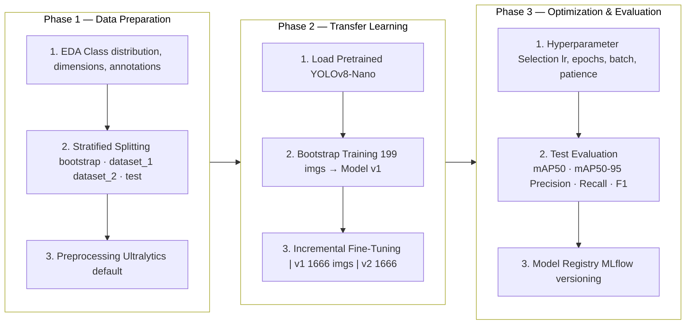
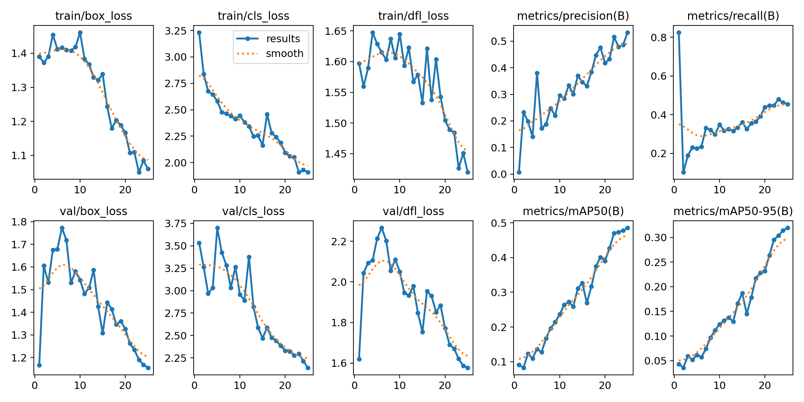
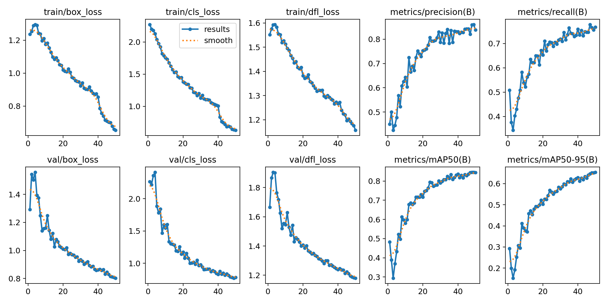
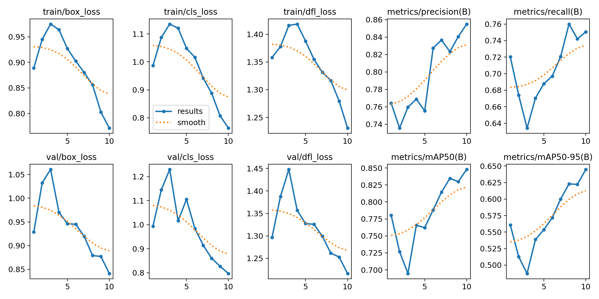
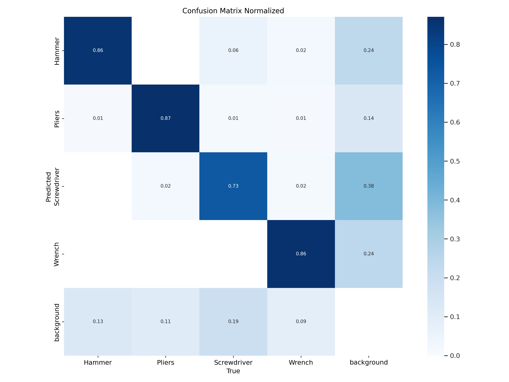
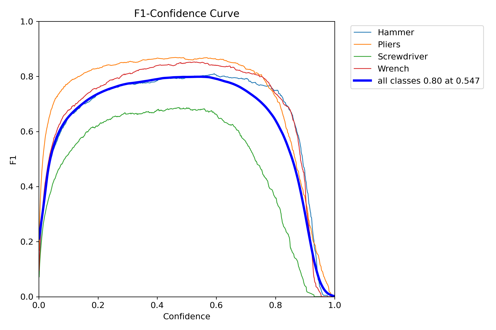
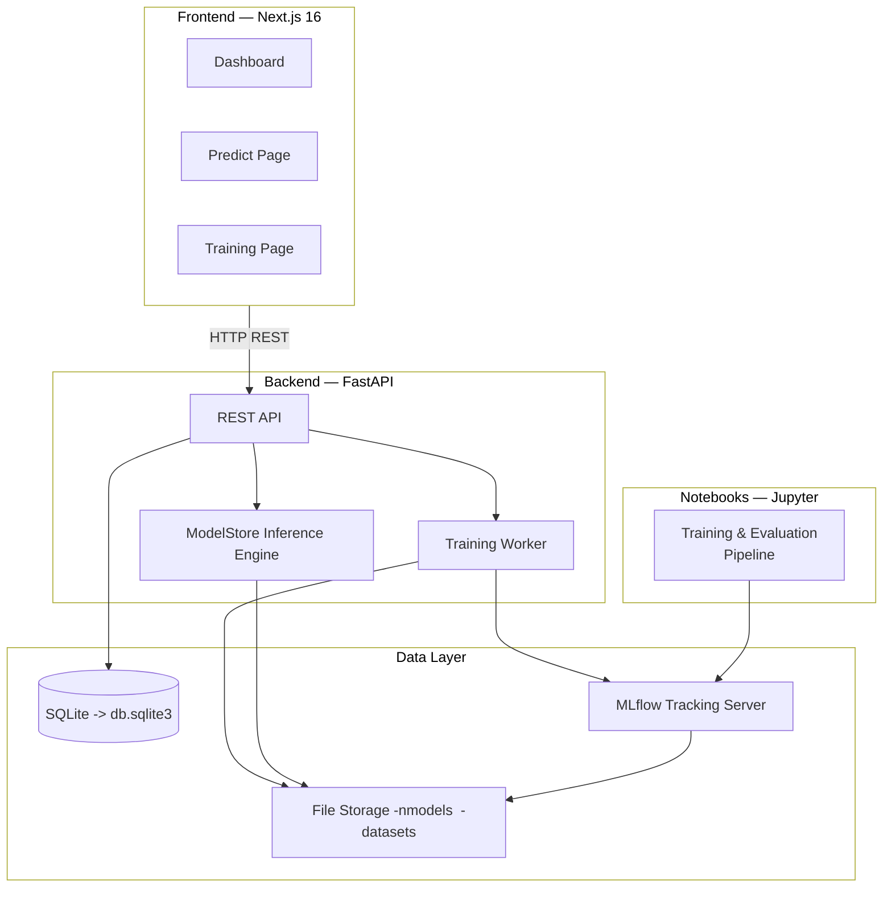

# Tools Detection — YOLOv8 Object Detection Pipeline

## Abstract

Automatic detection of hand tools in images is a challenging computer vision task due to high intra-class variability, class imbalance, and limited computational resources in lightweight deployment scenarios. These factors often reduce training stability and generalization performance. This work presents an end-to-end system for hand tool detection focused on four common classes: hammer, pliers, screwdriver, and wrench.

The proposed approach is based on YOLOv8-Nano and leverages transfer learning combined with an incremental fine-tuning strategy. A three-phase iterative methodology is adopted, consisting of dataset preparation and analysis, transfer training using a balanced bootstrap subset, and progressive hyperparameter optimization. This design aims to improve convergence while maintaining computational efficiency and reproducibility.

The model is trained and evaluated on an annotated hand tool dataset with explicit splits for training, validation, and a fixed test set of 893 images, ensuring consistent evaluation. Performance is assessed using mean Average Precision at IoU 0.5 (mAP@50). The final model achieves a mAP@50 of 0.848 on the fixed test set. The system is integrated into a web application using FastAPI and Next.js for interactive inference. Future work includes dataset expansion, additional evaluation metrics, and real-time deployment.

---

## Proposed Method

The pipeline follows a CRISP-DM-inspired methodology adapted for deep learning, organized in three sequential phases. Each phase maps directly to the notebook pipeline (Notebooks 1-5).

---

## Proposed Method Parameters

| Parameter | Value |
|-----------|-------|
| Input format | YOLOv8 bbox (4 classes: Hammer, Pliers, Screwdriver, Wrench) |
| Resize | 640 × 640 px (Ultralytics default augmentations) |
| Base model | YOLOv8-Nano — 3.2M params, pretrained on COCO |
| Optimizer | AdamW (lr=0.01, weight_decay=5e-4) |
| Training | 25–50 epochs, batch size 8, early stopping |
| Data scaling | 199 → 800 → 1,666 images (incremental) |
| Test set | 893 images (fixed, never used for training) |
| Metrics | mAP50, mAP50-95, Precision, Recall, F1 |
| Tracking | MLflow Model Registry |

### Pipeline Steps

**Input:** 5,204 images with 11 classes in YOLOv8 format (Roboflow)

**Phase 1 — Data Preparation** *(Notebooks 1-2)*

1. **Exploratory Data Analysis**
   1. Compute image dimension statistics (width, height, aspect ratio)
   2. Analyze class distribution across training and test splits
   3. Calculate annotation-per-image statistics and bounding box size distributions
   4. Visualize sample images with bounding box overlays
2. **Class Selection & Filtering**
   1. Merge duplicate classes: `Pliers` (class 6) + `plier` (class 10) → single `Pliers`
   2. Keep only the top 4 classes (Hammer, Pliers, Screwdriver, Wrench); discard 7 minority classes
   3. Remap class IDs to 0–3 (contiguous)
3. **Stratified Splitting**
   1. Create `bootstrap` subset (199 images) for initial transfer learning
   2. Create `dataset_1` (800 images) and `dataset_2` (1,666 images) for incremental fine-tuning
   3. Create fixed `test` set (893 images) from original test split — shared across all models

**Phase 2 — Transfer Learning** *(Notebook 3)*

1. **Load Pretrained Model:** YOLOv8-Nano with COCO weights (80 classes)
2. **Bootstrap Training:** Train on bootstrap subset (199 images) → Model v1
3. **Evaluation:** Compute mAP50, mAP50-95, Precision, Recall, F1 on fixed test set
4. **MLflow Logging:** Log hyperparameters, metrics, training curves, and register model checkpoint

**Phase 3 — Incremental Fine-Tuning** *(Notebook 5)*

1. **Base Model Selection:** Load previous best checkpoint from MLflow Registry
2. **Error Analysis:** Predict on new training data; identify low-confidence and missed detections
3. **Fine-Tuning Round 1:** Retrain v1 on dataset_1 (800 images) → Model v2
4. **Fine-Tuning Round 2:** Retrain v2 on dataset_2 (1,666 images) → Model v3
5. **Post-Retraining Evaluation:** Compare before vs after metrics on fixed test set

**Phase 4 — Evaluation & Prediction** *(Notebook 4)*

1. **Model Comparison:** Load any model version from MLflow and evaluate on fixed test set
2. **Results Visualization:** Generate confusion matrices, F1-curves, and prediction samples
3. **Inference:** Run single-image or batch prediction with confidence thresholds

**Output:** Best model (v3) with mAP50 = 0.848 on fixed test set, registered in MLflow

---

## Design and Experimentation

### Dataset Characteristics

Data sourced from [Roboflow](https://roboflow.com/) under **CC BY 4.0** license.

| Dataset | Format | Images | Classes | Link |
|---------|--------|--------|---------|------|
| **Tools Detection** | YOLOv8 bbox | 5,204 | 11 | [paul-space/tools-bynck](https://universe.roboflow.com/paul-space-qcfcl/tools-bynck-wpynu) |
| **Tools Segmentation** | YOLOv8 seg | 3,097 | 4 | [paul-space/tools-segmentation](https://universe.roboflow.com/paul-space-qcfcl/tools-segmentation-f2nhg-tf2cd) |

The detection dataset is stratified into:

| Split | Images | Purpose |
|-------|--------|---------|
| `bootstrap` | 199 | Initial transfer learning (Notebook 3) |
| `dataset_1` | 800 | First fine-tuning round (Notebook 5) |
| `dataset_2` | 1,666 | Second fine-tuning round (Notebook 5) |
| `test` | 893 | Fixed evaluation (never used for training) |

### Optimization Parameters

All models share the same base architecture (YOLOv8-Nano). Optimization isolates the effect of training data volume by keeping hyperparameters constant across versions.

| Parameter | Value |
|-----------|-------|
| Architecture | YOLOv8n (3.2M params) |
| Optimizer | AdamW (lr=0.01, weight_decay=5e-4) |
| Epochs | 50, 20 (early stopping) |
| Batch size | 8, 8 |
| Augmentations | Defautl Ultralytics YoloV8 nano, and resize 640px 640px |

---

## Results

### Model Metrics by Version

| Model | Training Data | mAP50 | mAP50-95 | Precision | Recall | F1 |
|-------|--------------|-------|----------|-----------|--------|-----|
| Bootstrap (v1) | bootstrap (199 imgs) | 0.485 | 0.319 | 0.532 | 0.457 | 0.492 |
| Fine-tune (v2) | dataset_1 (800 imgs) | 0.845 | 0.654 | 0.836 | 0.768 | 0.801 |
| Fine-tune (v3) | dataset_2 (1,666 imgs) | **0.848** | **0.654** | **0.855** | 0.751 | 0.799 |

All evaluated on the same fixed test set (893 images).

### Training Curves

| Bootstrap (v1) | Fine-tune v2 | Fine-tune v3 |
|:-:|:-:|:-:|
|  |  |  |

### Confusion Matrix & F1-Curve Model v3

| Confusion Matrix | F1 Curve |
|:-:|:-:|
|  |  |

---

## Conclusions

- Incremental fine-tuning yielded significant gains: mAP50 improved from 0.485 (v1, 199 imgs) to 0.848 (v3, 1666 imgs), a **74.8% increase**.
- The v2→v3 transition shows **diminishing returns** (mAP50: 0.845 → 0.848), suggesting a performance plateau for the YOLOv8-Nano architecture at this data scale.
- Precision improves consistently (0.532 → 0.855) while recall stabilizes (~0.75), indicating the model favors confident detections over exhaustive coverage.
- A **resize-only preprocessing** approach (no extra augmentations) proved sufficient for this domain, simplifying the pipeline without sacrificing accuracy.
- Systematic tracking via **MLflow Model Registry** enables full reproducibility and direct version comparison across experiments.

---

## Web Application

The system includes a full-stack application for interactive inference and model management.

---

## Technology Stack

**Notebooks / ML Pipeline**

        

**Backend**

    

**Frontend**

   

---

## References

- **Ultralytics YOLOv8**: Jocher, G., Chaurasia, A., & Qiu, J. (2023). *YOLO by Ultralytics*. https://github.com/ultralytics/ultralytics
- **Tools Detection Dataset (Roboflow)**: https://universe.roboflow.com/paul-space-qcfcl/tools-bynck-wpynu
- **Tools Segmentation Dataset (Roboflow)**: https://universe.roboflow.com/paul-space-qcfcl/tools-segmentation-f2nhg-tf2cd
- **MLflow**: Zaharia, M. et al. (2018). *Accelerating the Machine Learning Lifecycle with MLflow*. https://mlflow.org
