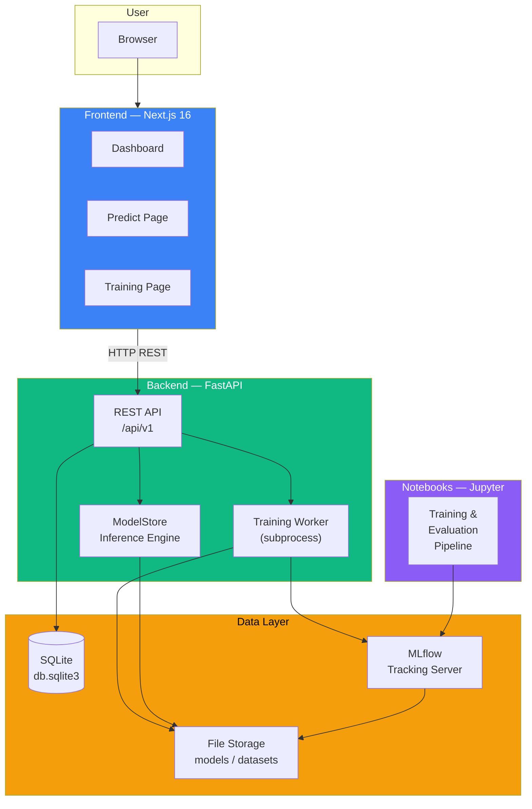
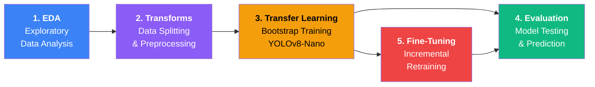
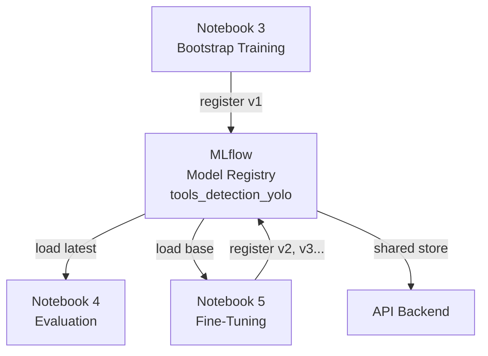
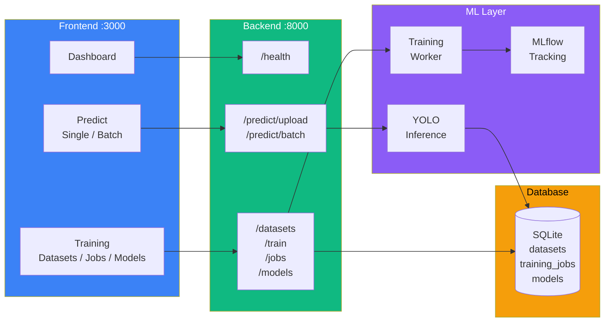
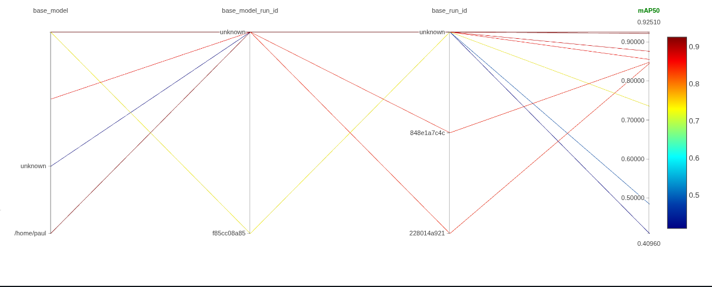
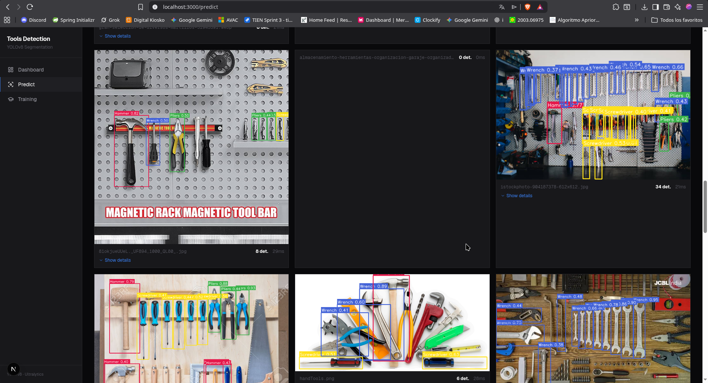
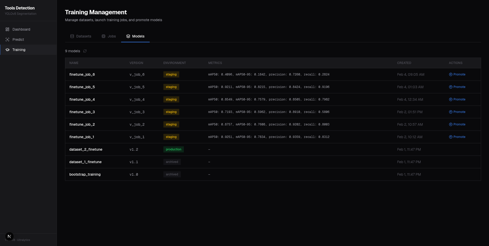
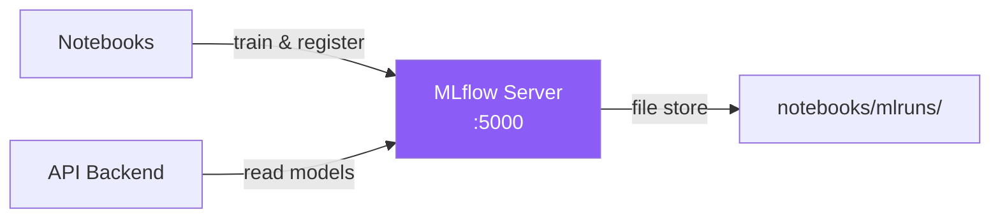

# Tools Detection — Full-Stack ML Pipeline

End-to-end machine learning system for **detecting hand tools** in images using
YOLOv8 object detection. Includes a training pipeline in Jupyter notebooks, a
FastAPI inference backend, and a Next.js interactive frontend.

**Detected classes**: Hammer, Pliers, Screwdriver, Wrench


---

## System Architecture



---

## Notebook Pipeline

The training pipeline is organized as five sequential notebooks:



| # | Notebook | What It Does |
|---|----------|--------------|
| 1 | **EDA** | Analyze class distribution, image dimensions, annotation statistics |
| 2 | **Transforms** | Split raw Roboflow data into bootstrap / dataset_1 / dataset_2 / test subsets |
| 3 | **Transfer Learning** | Train YOLOv8-Nano on the small bootstrap dataset (199 images). Register model in MLflow |
| 4 | **Evaluation** | Load any model from MLflow Model Registry. Evaluate on the fixed 893-image test set. Single and batch prediction |
| 5 | **Fine-Tuning** | Load a base model from the registry, retrain on new data, compare before vs. after metrics |

### Model Registry Flow



---

## Application Architecture



---

## Technology Stack

### Notebooks / ML Pipeline

| Technology | Purpose |
|------------|---------|
|  | Programming language |
|  | Object detection model |
|  | Deep learning framework |
|  | Experiment tracking & model registry |
|  | Interactive development |
|  | Image processing |
|  | Data analysis |
|  | Visualization |

### Backend API

| Technology | Purpose |
|------------|---------|
|  | REST API framework |
|  | Lightweight database |
|  | ASGI server |

### Frontend

| Technology | Purpose |
|------------|---------|
|  | React framework |
|  | UI library |
|  | Type safety |
|  | Styling |

---

## Datasets

Data sourced from [Roboflow](https://roboflow.com/) — licensed under
**CC BY 4.0**.

| Dataset | Format | Images | Classes | Link |
|---------|--------|--------|---------|------|
| **Tools Detection** | YOLOv8 bbox | 5,204 | 11 | [paul-space-qcfcl/tools-bynck-wpynu](https://universe.roboflow.com/paul-space-qcfcl/tools-bynck-wpynu) |
| **Tools Segmentation** | YOLOv8 segmentation | 3,097 | 4 | [paul-space-qcfcl/tools-segmentation-f2nhg-tf2cd](https://universe.roboflow.com/paul-space-qcfcl/tools-segmentation-f2nhg-tf2cd) |

### Preprocessed Splits

After running Notebook 2, the detection dataset is split into:

| Split | Images | Purpose |
|-------|--------|---------|
| `bootstrap` | 199 | Initial transfer learning (Notebook 3) |
| `dataset_1` | 800 | First fine-tuning round (Notebook 5) |
| `dataset_2` | 1,666 | Second fine-tuning round (Notebook 5) |
| `test` | 893 | Fixed evaluation set (never used for training) |

---

## Project Structure

```
tools-detection/
├── README.md                   # This file
├── launch_mlflow_ui.sh         # Start MLflow UI/tracking server
│
├── notebooks/                  # ML training pipeline
│   ├── 1_EDA_tools.ipynb
│   ├── 2_Transforms.ipynb
│   ├── 3_Model_trasfer_learning.ipynb
│   ├── 4_Evaluation_model.ipynb
│   ├── 5_Incremental_fine_tuning.ipynb
│   ├── utils/                  # Shared Python modules
│   ├── data/                   # Roboflow datasets
│   ├── mlruns/                 # MLflow tracking store
│   ├── runs/                   # YOLO training outputs
│   └── requirements.txt
│
├── api_tols/                   # FastAPI backend
│   ├── app/
│   │   ├── main.py             # Entry point
│   │   ├── routers/            # API endpoints
│   │   ├── models_store.py     # YOLO inference engine
│   │   ├── database.py         # SQLite ORM
│   │   └── training_worker.py  # Background training
│   ├── storage/                # Runtime data (DB, models, datasets)
│   └── requirements.txt
│
└── fronted_tols/               # Next.js frontend
    ├── app/                    # Pages (Dashboard, Predict, Training)
    ├── components/             # Reusable UI components
    ├── lib/                    # API client & types
    └── package.json
```

---

## Quick Start

### 1. MLflow Tracking Server

```bash
./launch_mlflow_ui.sh
# Opens at http://127.0.0.1:5000
```




### 2. Notebooks (Training)

```bash
cd notebooks
python -m venv venv
source venv/bin/activate
pip install -r requirements.txt
jupyter notebook
```

Run notebooks 1 through 5 in order. Models are automatically registered in
MLflow after training.

### 3. API Backend

```bash
cd api_tols
python -m venv venv
source venv/bin/activate
pip install -r requirements.txt
uvicorn app.main:app --host 0.0.0.0 --port 8000 --reload
```

API docs available at `http://localhost:8000/docs`.

### 4. Frontend

```bash
cd fronted_tols
npm install
npm run dev
```

Opens at `http://localhost:3000`.





---

## MLflow

All components share a single MLflow tracking store at `notebooks/mlruns/`.
The `launch_mlflow_ui.sh` script starts the MLflow server that both notebooks
and the API connect to.



Models are registered under `tools_detection_yolo` in the Model Registry.
Each training or fine-tuning run creates a new version that can be loaded by
version number or as "latest".

---

## Training Results

| Model | Dataset | mAP50 | mAP50-95 | Precision | Recall | F1 |
|-------|---------|-------|----------|-----------|--------|-----|
| Bootstrap (v1) | bootstrap (199 imgs) | 0.485 | 0.319 | 0.532 | 0.457 | 0.492 |
| Fine-tune (v2) | dataset_1 (800 imgs) | 0.845 | 0.654 | 0.836 | 0.768 | 0.801 |
| Fine-tune (v3) | dataset_2 (1,666 imgs) | 0.848 | 0.644 | 0.855 | 0.751 | 0.799 |

All models evaluated on the same fixed test set (893 images).

