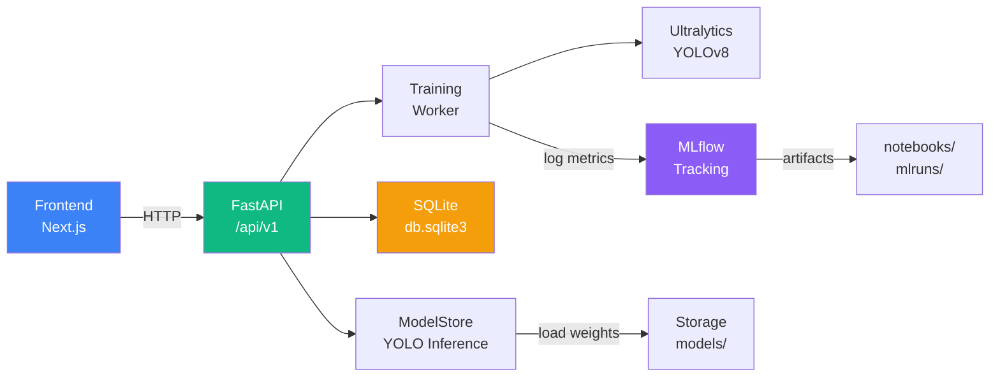
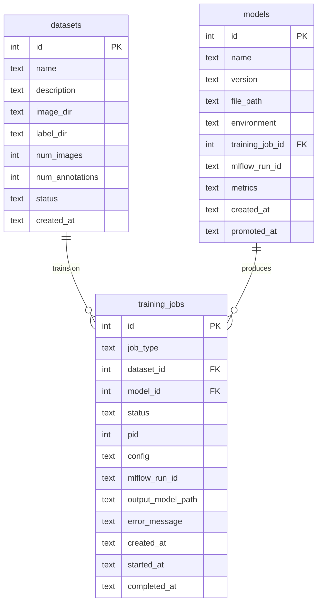
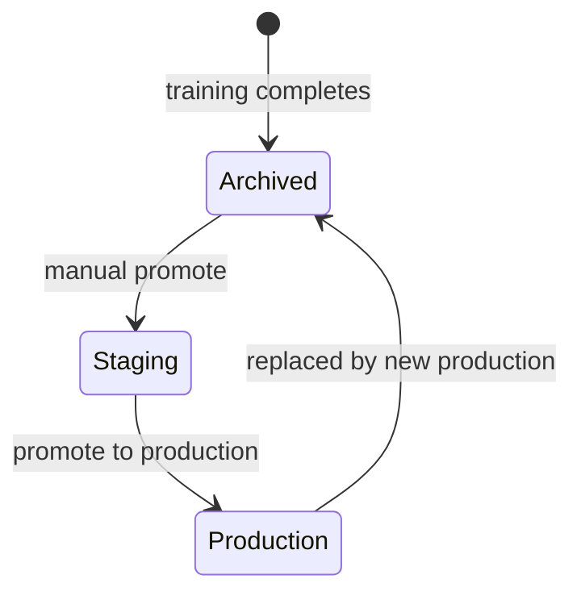

# API — Tools Detection Backend

REST API built with **FastAPI** for real-time tool detection inference,
dataset management, and training orchestration. Uses **YOLOv8** models
tracked in **MLflow** and a **SQLite** database for state management.

## Architecture



## API Endpoints

Base URL: `http://localhost:8000/api/v1`

### Health

| Method | Path | Description |
|--------|------|-------------|
| `GET` | `/health` | System status, loaded model version, device |

### Prediction

| Method | Path | Description |
|--------|------|-------------|
| `POST` | `/predict/upload` | Single image inference (multipart upload) |
| `POST` | `/predict/batch` | Batch inference on multiple images |

**Parameters**: `file` (image), `score_threshold` (0.0–1.0), `model_id` (optional)

**Response**: detections (class, confidence, bbox), annotated image (base64 PNG), inference time.

### Classes

| Method | Path | Description |
|--------|------|-------------|
| `GET` | `/classes` | List detectable tool classes with color codes |

Classes: `Hammer`, `Pliers`, `Screwdriver`, `Wrench`

### Datasets

| Method | Path | Description |
|--------|------|-------------|
| `GET` | `/datasets` | List uploaded datasets (filterable by status) |
| `POST` | `/datasets` | Upload a new dataset (images + YOLO labels or COCO JSON) |

### Training Jobs

| Method | Path | Description |
|--------|------|-------------|
| `GET` | `/jobs` | List training jobs (filterable by status) |
| `POST` | `/train` | Queue a new training job |
| `POST` | `/jobs/{id}/cancel` | Cancel a running job (SIGTERM) |

**Training config**: `epochs`, `learning_rate`, `batch_size`, `freeze_epochs`, `device`

### Models

| Method | Path | Description |
|--------|------|-------------|
| `GET` | `/models` | List all models (filterable by environment) |
| `POST` | `/models/{id}/promote` | Promote a staging model to production |

## Database Schema



**Environments**: `production`, `staging`, `archived`

## Directory Structure

```
api_tols/
├── app/
│   ├── main.py              # FastAPI application entry point
│   ├── config.py            # Paths, class names, MLflow config
│   ├── models_store.py      # Model loading, caching, inference
│   ├── database.py          # SQLite schema and queries
│   ├── schemas.py           # Pydantic request/response models
│   ├── training_worker.py   # Background training subprocess
│   ├── annotation_utils.py  # Annotation format processing
│   └── routers/
│       ├── health.py        # GET /health
│       ├── predict.py       # POST /predict/upload, /predict/batch
│       ├── classes.py       # GET /classes
│       ├── datasets.py      # GET/POST /datasets
│       ├── models.py        # GET /models, POST /models/{id}/promote
│       └── jobs.py          # GET /jobs, POST /train, POST /jobs/{id}/cancel
├── storage/
│   ├── db.sqlite3           # SQLite database
│   ├── models/              # Trained model outputs
│   └── datasets/            # Uploaded datasets
├── requirements.txt
├── yolov8n.pt               # Pretrained COCO weights (fallback)
└── .python-version
```

## Model Lifecycle



The **ModelStore** singleton caches loaded YOLO models in memory for fast
inference. The production model is loaded automatically at startup.

## Training Worker

Training runs as a separate subprocess (`training_worker.py`) to avoid
blocking the API. The worker:

1. Reads job config from the database
2. Resolves the base model (specified, production, or pretrained weights)
3. Creates a YOLO `data.yaml` from the dataset
4. Runs `model.train()` with the configured hyperparameters
5. Extracts metrics (mAP50, mAP50-95, precision, recall)
6. Registers the output model in the database
7. Updates the job status to `completed` or `failed`

## MLflow Integration

The API shares the same MLflow file store as the notebooks
(`notebooks/mlruns/`). Training jobs log metrics and artifacts to MLflow,
enabling comparison across notebook and API training runs.

## Setup

```bash
cd api_tols

# Create virtual environment
python -m venv venv
source venv/bin/activate

# Install dependencies
pip install -r requirements.txt

# Run the API
uvicorn app.main:app --host 0.0.0.0 --port 8000 --reload
```

### Key Dependencies

- `fastapi` — Web framework
- `uvicorn` — ASGI server
- `ultralytics` — YOLOv8 inference and training
- `torch` / `torchvision` — Deep learning backend
- `mlflow` — Experiment tracking
- `opencv-python-headless` — Image processing
- `python-multipart` — File uploads

### Pre-registered Models

On first startup, the database auto-registers these known models:

| Name | Version | Environment |
|------|---------|-------------|
| `bootstrap_training` | v1.0 | archived |
| `dataset_1_finetune` | v1.1 | archived |
| `dataset_2_finetune` | v1.2 | production |
