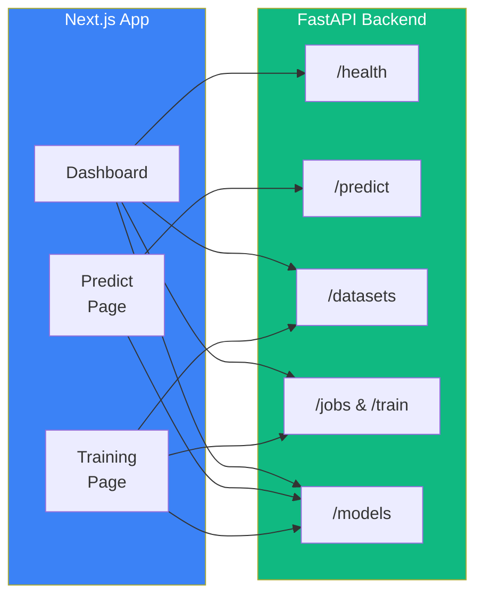

# Frontend — Tools Detection UI

Interactive web interface built with **Next.js 16** and **React 19** for
real-time tool detection, dataset management, and training orchestration.

## Architecture



## Pages

### Dashboard (`/`)

System overview with health status, counts (datasets, jobs, models), and
quick navigation links.

### Predict (`/predict`)

Two inference modes:

- **Single Image** — Upload one image, adjust confidence threshold, view
  annotated result with detection boxes, class labels, and scores.
- **Batch Mode** — Upload multiple images, process together, view results
  grid with expandable details.

Both modes support model selection (defaults to production model).

### Training (`/training`)

Three tabs:

| Tab | Features |
|-----|----------|
| **Datasets** | List datasets, upload new datasets with two modes: draw bounding box annotations in-browser or upload YOLO label files |
| **Jobs** | List training jobs, create new jobs with configurable hyperparameters (epochs, LR, batch size, freeze epochs), cancel running jobs |
| **Models** | List all models by environment, promote staging models to production |

## Components

| Component | Description |
|-----------|-------------|
| `Sidebar` | Navigation sidebar with links to Dashboard, Predict, Training |
| `ImageDropzone` | Single-file drag-and-drop for prediction uploads |
| `BatchDropzone` | Multi-file drag-and-drop with file size display |
| `ModelSelector` | Dropdown that auto-selects the current production model |
| `BboxAnnotator` | Interactive canvas tool for drawing bounding box annotations in YOLO format |

## Directory Structure

```
fronted_tols/
├── app/
│   ├── layout.tsx          # Root layout with sidebar
│   ├── page.tsx            # Dashboard
│   ├── globals.css         # Dark theme, Tailwind config
│   ├── predict/
│   │   └── page.tsx        # Prediction page
│   └── training/
│       └── page.tsx        # Training management page
├── components/
│   ├── sidebar.tsx         # Navigation sidebar
│   ├── image-dropzone.tsx  # Single image upload
│   ├── batch-dropzone.tsx  # Multi-image upload
│   ├── model-selector.tsx  # Model picker dropdown
│   └── bbox-annotator.tsx  # Bounding box drawing canvas
├── lib/
│   ├── api.ts              # API client (fetch wrappers)
│   └── types.ts            # TypeScript type definitions
├── public/                 # Static assets
├── package.json
├── tsconfig.json
├── next.config.ts
├── postcss.config.mjs
└── tailwind.config.ts
```

## Tech Stack

| Technology | Version | Purpose |
|------------|---------|---------|
| Next.js | 16.1.6 | React framework with App Router |
| React | 19.2.3 | UI library |
| TypeScript | 5 | Type safety |
| Tailwind CSS | 4 | Utility-first styling |
| lucide-react | 0.563.0 | Icon library |
| react-dropzone | 14.4.0 | File upload drag-and-drop |

## API Connection

The frontend communicates with the FastAPI backend via the `lib/api.ts`
client. The base URL is configured through an environment variable:

```env
NEXT_PUBLIC_API_URL=http://localhost:8000
```

All API calls go to `/api/v1/*` endpoints.

## Theme

Dark theme with:
- Background: `#09090b`
- Surface: `#18181b`
- Accent: `#3b82f6` (blue)
- Font: Geist Sans / Geist Mono

## Setup

```bash
cd fronted_tols

# Install dependencies
npm install

# Development server
npm run dev

# Production build
npm run build
npm start
```

The frontend runs on `http://localhost:3000` by default and expects the API
at `http://localhost:8000`.
