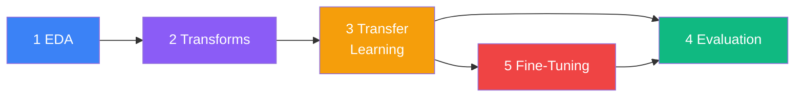
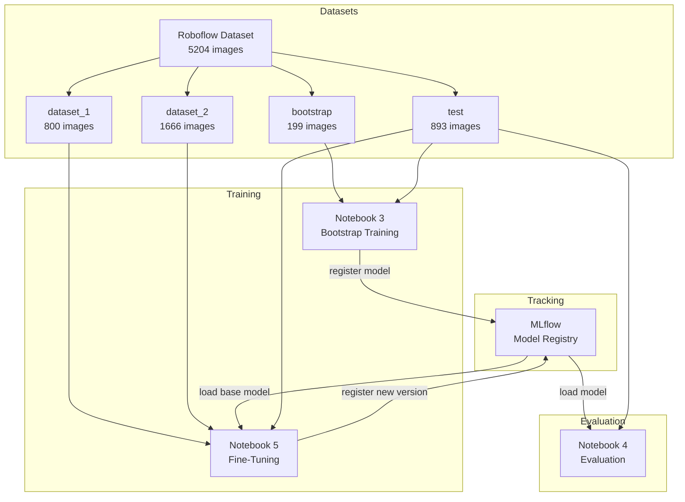

# Notebooks — Training & Evaluation Pipeline

End-to-end pipeline for training, evaluating, and incrementally fine-tuning
YOLOv8 object detection models for tool recognition. All experiments are
tracked with **MLflow**.

## Notebook Pipeline



| # | Notebook | Purpose |
|---|----------|---------|
| 1 | `1_EDA_tools.ipynb` | Exploratory data analysis — class distribution, image sizes, annotation statistics |
| 2 | `2_Transforms.ipynb` | Data splitting and preprocessing — creates balanced bootstrap, dataset_1, dataset_2 subsets |
| 3 | `3_Model_trasfer_learning.ipynb` | Bootstrap training with YOLOv8-Nano pretrained on COCO. Logs run to MLflow |
| 4 | `4_Evaluation_model.ipynb` | Load any model from MLflow (registry or run_id). Evaluate on fixed test set. Single-image and batch prediction |
| 5 | `5_Incremental_fine_tuning.ipynb` | Fine-tune an existing model on new data (dataset_1, dataset_2). Before/after comparison |

## Data Flow



## Directory Structure

```
notebooks/
├── 1_EDA_tools.ipynb
├── 2_Transforms.ipynb
├── 3_Model_trasfer_learning.ipynb
├── 4_Evaluation_model.ipynb
├── 5_Incremental_fine_tuning.ipynb
├── utils/
│   ├── config.py              # Paths, class names, MLflow config
│   ├── mlflow_helpers.py      # MLflow connection, model loading/registration
│   ├── training_helpers.py    # Device setup, YAML generation, evaluation
│   ├── dataset_manager.py     # Dataset splitting utilities
│   ├── eda_helpers.py         # EDA visualization functions
│   └── rename_labels.py       # Label normalization
├── data/
│   ├── Tools.v1i.yolov8/     # Original Roboflow dataset (detection)
│   ├── Tools segmentation.v1i.yolov8/  # Segmentation dataset
│   └── pre_process/           # Split subsets (bootstrap, dataset_1, ...)
├── mlruns/                    # MLflow tracking store
├── runs/                      # YOLO training outputs
├── best_model/                # Best checkpoint symlink
├── images_prediction/         # Custom test images
├── requirements.txt
└── yolov8n.pt                 # Pretrained COCO weights
```

## Utility Modules

### `utils/config.py`

Centralized constants shared across all notebooks:

| Constant | Description |
|----------|-------------|
| `MLFLOW_TRACKING_URI` | MLflow server URL (`http://127.0.0.1:5000`) |
| `MLFLOW_MODEL_NAME` | Registry model name (`tools_detection_yolo`) |
| `CLASS_NAMES` | `["Hammer", "Pliers", "Screwdriver", "Wrench"]` |
| `PRETRAINED_WEIGHTS` | Path to `yolov8n.pt` |
| `SEED` | `42` for reproducibility |

### `utils/mlflow_helpers.py`

| Function | Description |
|----------|-------------|
| `setup_mlflow()` | Connect to MLflow server (fallback to file store) |
| `list_runs()` | DataFrame of all experiment runs |
| `load_model_from_run(run_id)` | Download `.pt` weights from a specific run |
| `load_model_from_registry(name, version)` | Download `.pt` from Model Registry (latest or specific version) |
| `list_registered_model_versions(name)` | DataFrame of all registered model versions |
| `register_yolo_model(best_pt, name)` | Register a `.pt` model in the MLflow Model Registry |
| `log_yolo_run_artifacts(dir)` | Log YOLO curves/images to active run |
| `log_yolo_epoch_metrics(dir)` | Log per-epoch training metrics from `results.csv` |

### `utils/training_helpers.py`

| Function | Description |
|----------|-------------|
| `get_device()` | Detect CUDA GPU or fallback to CPU |
| `create_dataset_yaml(name)` | Generate YOLO `data.yaml` for a dataset subset |
| `evaluate_model(model, ...)` | Run validation, return mAP/precision/recall/F1 |
| `visualize_predictions(model, dir)` | Grid visualization of model predictions |
| `predict_single(model, path)` | Single-image inference with detections |
| `predict_directory(model, dir)` | Batch inference on a folder |

## MLflow Integration

All notebooks connect to the MLflow tracking server started by
`launch_mlflow_ui.sh`:

```bash
# From project root
./launch_mlflow_ui.sh        # default port 5000
./launch_mlflow_ui.sh 5001   # custom port
```

Models are registered in the **Model Registry** under the name
`tools_detection_yolo`. Each fine-tuning run creates a new version.

### Loading Models

```python
from utils.mlflow_helpers import setup_mlflow, load_model_from_registry
from ultralytics import YOLO

experiment = setup_mlflow()

# Latest version
model_path = load_model_from_registry()
model = YOLO(str(model_path))

# Specific version
model_path = load_model_from_registry(version="2")
model = YOLO(str(model_path))
```

## Reproducibility

### Requirements

```bash
cd notebooks
python -m venv venv
source venv/bin/activate
pip install -r requirements.txt
```

### Key Dependencies

- `ultralytics` — YOLOv8 training and inference
- `mlflow` — Experiment tracking and model registry
- `torch` / `torchvision` — Deep learning backend
- `pandas`, `matplotlib`, `opencv-python` — Data analysis and visualization

### Datasets

Download the datasets from Roboflow:

| Dataset | Format | Images | Classes | Source |
|---------|--------|--------|---------|--------|
| Tools Detection | YOLOv8 | 5,204 | 11 | [paul-space-qcfcl/tools-bynck-wpynu](https://universe.roboflow.com/paul-space-qcfcl/tools-bynck-wpynu) |
| Tools Segmentation | YOLOv8 | 3,097 | 4 | [paul-space-qcfcl/tools-segmentation-f2nhg-tf2cd](https://universe.roboflow.com/paul-space-qcfcl/tools-segmentation-f2nhg-tf2cd) |

Both datasets are licensed under **CC BY 4.0**.

Place them in `notebooks/data/` and run Notebook 2 to create the preprocessed
splits.

### Training Parameters

| Parameter | Bootstrap (NB3) | Fine-Tuning (NB5) |
|-----------|-----------------|-------------------|
| Epochs | 25 | 10 |
| Batch Size | 8 | 8 |
| Image Size | 640 | 640 |
| Learning Rate | 0.01 | 0.001 |
| Seed | 42 | 42 |
